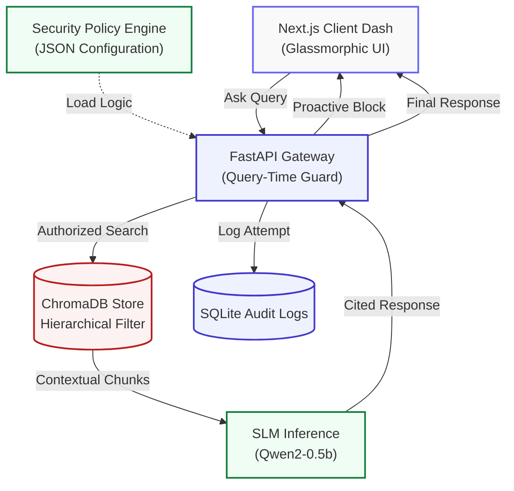

# 🛡️ Secure Enterprise RAG: Zero-Trust Data Intelligence

An enterprise-grade, production-ready **Retrieval-Augmented Generation (RAG)** platform designed for internal corporate data. Built with a **Zero-Trust Security Architecture**, this system ensures that sensitive information is never leaked to unauthorized users while providing transparent, citation-backed AI responses.

  

---

## 🚀 Key Feature Pillars

### 1. 🛡️ Hierarchical Zero-Trust Pipeline
Unlike standard RAG systems, this platform implements security **at the database level**:
- **Chunk-Level Clearance**: Documents are split into 500-character chunks, each with its own `clearance_level` (Admin=3, Manager=2, Employee=1).
- **Mathematical Isolation**: Queries use a strict `$lte` (Less Than or Equal) metadata filter. An Employee (Level 1) can **physically never retrieve** Admin-level (Level 3) data chunks.

### 2. 🧠 Dynamic Security Policy Engine
Configuration stays out of the code. A centralized `security_policies.json` drives the platform's awareness:
- **Proactive Query Guard**: Incoming queries are scanned for sensitive keywords and regex patterns (e.g., project codenames, salary patterns).
- **Instant Interception**: Restricted queries are shut down BEFORE they reach the AI, eliminating "helper-hallucinations" simulating data leaks.
- **AI Auto-Classification**: Uses a local SLM (**Qwen2-0.5b**) with a heuristic booster to automatically tag document chunks during ingestion.

### 3. 🔍 Explainable AI (XAI)
Establish absolute trust with stakeholders through transparent sourcing:
- **Source Citation Modals**: Every AI answer features clickable citation badges.
- **Glassmorphic UI**: Inspect the exact text snippet the AI read to generate its answer, ensuring 100% verifiability.
- **Strict Hallucination Guardrails**: The model is forbidden from answering if the retrieved context is insufficient.

### 4. 👮 Admin Command Center
A visual cockpit for security administrators:
- **Real-Time Analytics**: Visual tracking of "Intrusion Attempts" vs. "Granted Queries" using Recharts.
- **Document Vault**: A management dashboard to monitor, audit, and delete ingested documents from the vector store.
- **PII Sanitization**: Automated regex-based redaction of SSNs, Credit Cards, and Phone numbers during ingestion.

---

## 🏗️ System Architecture



---

## 🛠️ Technology Stack

- **Frontend**: Next.js 15 (App Router), Tailwind CSS, Lucide Icons, Recharts.
- **Backend**: FastAPI, Python 3.11+.
- **Database**: ChromaDB (Vector Search), SQLite (Audit & User DB).
- **AI Model**: Qwen2-0.5b (Ollama) - Optimized for local, private deployment.

---

## 🏃 Getting Started

### 1. Prerequisites
- **Ollama**: Install and run `ollama serve`.
- **Model**: `ollama pull qwen2:0.5b`.

### 2. Backend Setup
```bash
python -m venv venv
source venv/bin/activate
pip install -r requirements.txt
python main.py
```

### 3. Frontend Setup
```bash
cd frontend
npm install
npm run dev
```

---

## 🛡️ Security Configuration: `security_policies.json`
To update the system's security awareness without changing code:
```json
{
  "admin": {
    "keywords": ["salary", "m&a", "bonus", "project alpha"],
    "patterns": ["ACME-SEC-[0-9]{4}"]
  }
}
```
*Simply restart the backend to apply new policies.*

---

## 📜 License
Privately developed for Professional Portfolio demonstration. No unauthorized distribution.
