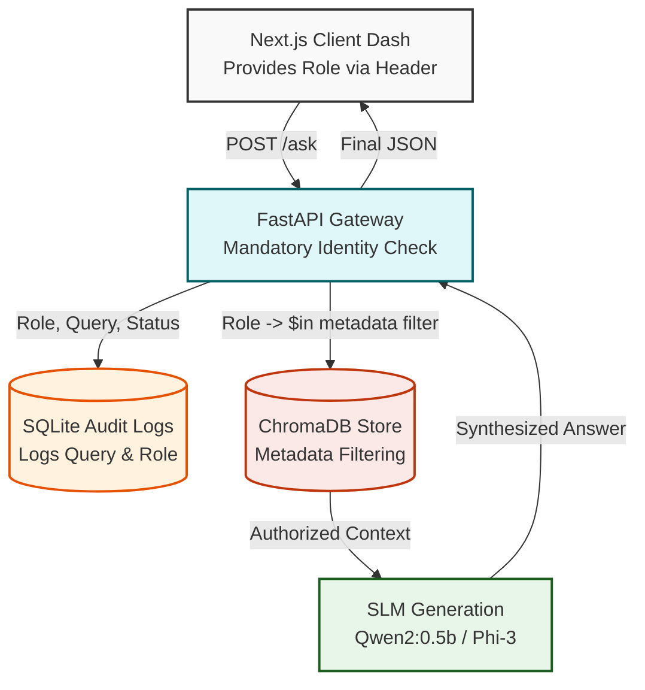

# Secure Enterprise RAG

An enterprise-grade Retrieval-Augmented Generation (RAG) system built with FastAPI, Next.js, and ChromaDB.

Designed specifically for corporate environments, this system prioritizes **Zero-Trust Architecture** and robust observability, ensuring that Large Language Models (LLMs) and Small Language Models (SLMs) only retrieve and process data the user is strictly authorized to see.

## 🚀 Key Features Highlights

### 🛡️ Zero-Trust Retrieval Pipeline
Built a secure bridge between a FastAPI gateway and a ChromaDB vector store. The system implements a mandatory identity-check middleware that injects metadata filters into every query. This guarantees that data isolation is handled **at the database level**, radically mitigating Prompt Injection attacks attempting to bypass application-layer logic.

### 📊 Observability & Compliance
Included an SQLite-based Audit Logger. Every query against the corporate knowledge base is logged with the simulated identity role (`Admin`, `Manager`, `Employee`), the exact text of the query, and the HTTP status response code. This enables complete tracing and auditing of AI utilization.

### ⚡ Text-First SaaS Dashboard
Built a highly responsive "Raycast/Spotlight" style Next.js frontend using Tailwind CSS. The interface removes experimental distractions and focuses purely on high-performance text retrieval, complete with explicit **RBAC Status Indicators** and "Sources" footer attribution, establishing high UX clarity for power users.

## 🏗️ Architecture



### Security Command Center Architecture

This project represents a complete Secure Software Development Lifecycle (SSDLC):

| Layer | Responsibility |
| --- | --- |
| **Identity (UI)** | Next.js Role Switcher + Header-based Auth Simulation. |
| **Gateway (API)** | FastAPI + RBAC Middleware + SQLite Audit Logging. |
| **Security (DB)** | ChromaDB Metadata Filtering (`$in` operator). |
| **Intelligence (LLM)** | Qwen2-0.5b (SLM) for local, private inference. |

## 🛠️ Tech Stack
- **Frontend**: Next.js (App Router), React, Tailwind CSS v4, Lucide React
- **Backend**: FastAPI, Python 3
- **Database**: ChromaDB (Vector Store), SQLite (Audit Logs)
- **AI Models**: Designed to route via local small LLMs (SLMs) like Qwen2 or Llama3 for rapid edge performance.

## 🏃 Getting Started

### 1. Start the Secure Backend
```bash
python main.py
# Or run with uvicorn directly
uvicorn main:app --reload
```

### 2. Start the Zero-Trust Dashboard
```bash
cd frontend
npm install
npm run dev
```

Navigate to `http://localhost:3000` to interact with the Next.js SaaS Command Bar interface.
